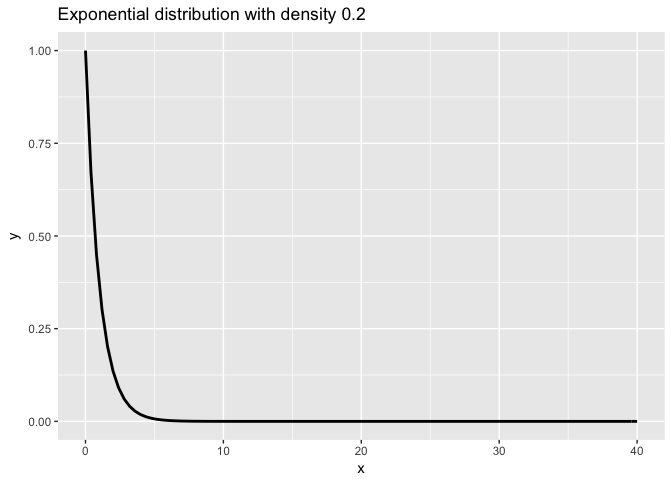
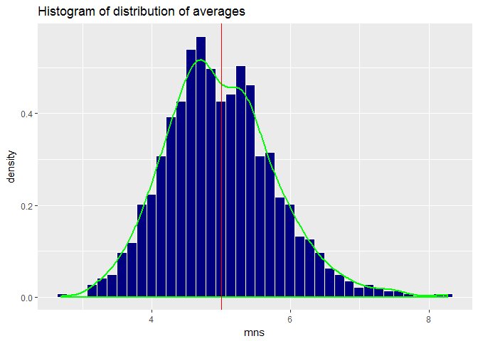
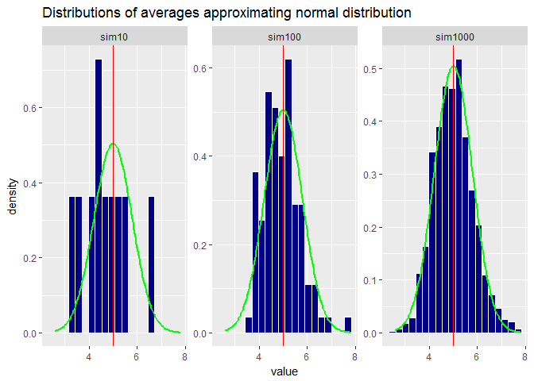

# Statistical Inference: Simulation Exercise
Thomas Bell  
20 september 2017  


# Overview
In this analysis the exponential distribution in R is compared with the Central Limit Theorem (CLT). The exponential distribution is simulated in R with rexp(n, lambda) where lambda is the rate parameter. The mean of exponential distribution is 1/lambda and the standard deviation is also 1/lambda.

The CLT states that the distribution of averages of independant and indentically distributed (iid) variables becomes that of a standard normal when the sample size increases. For this experiment we run 1000 simulations of 40 exponentials for which the mean is calculated. The distribution of means is compared with theoretical measures and with a standard normal (Gaussian).

The analysis underlined the theory: with an increased number of simulations, the distribution of averages approximates the standard normal distribution 

# Simulations
In this section the exponential distribution is explored and simulations are prepared for further analysis. The seed is set to be able to reproduce simulations. Lambda is set to 0.2 and the number of exponentials is n = 40.


```r
set.seed(1)
lambda <- .2
n <- 40
```

To refresh our minds we first plot the exponential distribution. The subsequent figure shows that when the number of exponentials is increased, the random generated distribution takes the shape of the exponential distribution.


```r
#To refresh our mind we show how an exponential distribution looks
df <- data.frame(x=seq(0,40,by=.2))
ggplot(df) + 
  stat_function(aes(x),fun=dexp, size = 1) + 
  ggtitle("Exponential distribution with density 0.2")
```

<!-- -->

```r
#By increasing n the distribution approximates the exponential distribution
df <- melt(data.frame(
  "n40" = rexp(40, lambda),
  "n100" = rexp(100, lambda),
  "n1000" = rexp(1000, lambda)
), measure.vars = c("n40","n100","n1000"))

ggplot(df, aes(x = value)) + 
  geom_histogram(bins = 20, col = "white", fill = "navy") + 
  facet_wrap(~variable, scales = "free_y", ncol = 1) +
  ggtitle("Random deviates with increasing exponentials")
```

<!-- -->

For the remainder of the analysis a distribution of averages is created of 1000 simulations of 40 exponentials with density 0.2.


```r
#For this research we proceed with an n of 40 for which we run a 1000 simulations for which we will investigate the distribution of the means
mns = NULL
for (i in 1 : 1000) mns = c(mns, mean(rexp(n, lambda)))
mns <- as.data.frame(mns)
```

# Sample Mean versus Theoretical Mean
In this section the sample mean is compared with the theoretical mean for the exponential distribution.


```r
#theoretical mean for exponentially distributed random variables with rate parameter lambda is E[X] = 1 / lambda = beta
theoretical_mean <- 1 / lambda

#sample mean is the mean of 1000 means
sample_mean <- mean(mns$mns)
```

Theoretical mean for exponentially distributed random variables with rate parameter lambda is: E[X] = 1 / lambda = beta

For our example this results in: E[X] = 1 / 0.2 = 5

The sample mean of our distribution of averages is 4.989162

In the following figure a histogram is plotted for the distribution of averages. Here it can be seen that the distribution is centered around the theoretical mean, highlighted with the vertical red line.


```r
ggplot(mns, aes(mns)) + 
        geom_histogram(bins = 40, aes(y=..density..), col = "white", fill = "navy") + 
        geom_density(col = "green", size = 1) + 
        geom_vline(aes(xintercept=theoretical_mean), col = "red") +
        ggtitle("Histogram of distribution of averages")
```

<!-- -->

# Sample Variance versus Theoretical Variance
In this section the sample variance is compared with the theoretical variance for the exponential distribution.


```r
#theoretical variance for exponentially distributed random variables with rate parameter lambda is Var[X] = (1 / lambda^2) / n = beta^2
theoretical_var <- (1 / lambda^2) / n

#sample variance is the power of sd of 1000 sds
sample_var <- var(mns$mns)
```

The theoretical population variance for exponentially distributed random variables is equal to Var[X] = 1 / lambda^2 = beta^2.

Which in our case is 1 / 0.2^2 = 25 

By dividing by the number of exponentials n, the theoretical variance for the distribution of averages can be calculated Var[Xbar] = (1 / lambda^2) / n = beta^2

For our example this results in: Var[Xbar]  = (1 / 0.2^2) / 40 = 0.625

The sample variance of our distribution of averages is 0.6300226, very close to our theoretical variance.

Variance is the average squared distance from the mean. According to the CLT, when the sample size n increases, observations become more centered around the mean. This also means that the average distance from the mean decreases. This is underlined by the theoretical formula for Var[Xbar], with n being the divider the output becomes smaller as n increases.

To summarise this part of the analysis theoretical and sample mean and variance are provided in the table below.


```r
Statistic <- c("Mean","Variance")
Sample <- c(round(sample_mean,3),round(sample_var,3))
Theoretical <- c(round(theoretical_mean,3),round(theoretical_var,3))
stat_table <- data.frame(Statistic,Sample,Theoretical)
kable(stat_table)
```


Statistic    Sample   Theoretical
----------  -------  ------------
Mean          4.989         5.000
Variance      0.630         0.625

# Distribution
The CLT entails that the distribution of means of iid variables tends towards a normal distribution, even if the original variables themselves are not normally distributed. In this analysis the original distributions were exponential.By taking the mean of each exponential distribution we create a new distribution in itself, the sample. Because we know that the sample approximates a normal distribution, probabilistic and statistical methods can be used to tell something about the population the sample was taken from.

If we plot a histogram of the distribution of averages for 10 simulations, the averages are not clearly centered around the mean. Increasing the number of simulations to 100 and subsequently to 1000, the bell-shaped curve which is associated with the normal distribution becomes visible.

The normal distribution is also a symmetrical distribution. Meaning the distribution is identically shaped on both sides of the mean. To illustrate this a vertical line is plotted on the theoretical mean. It can be seen that the bell-curves are indeed symmetrical and that these are normal distributions.


```r
sim_mns <- function(x) {
        out = NULL
        for (i in 1 : x) out = c(out, mean(rexp(n, lambda)))
        out
}

set.seed(200)
df <- melt(data.frame(
  "sim10" = sim_mns(10),
  "sim100" = sim_mns(100),
  "sim1000" = sim_mns(1000)
), measure.vars = c("sim10", "sim100", "sim1000"))

ggplot(df, aes(x = value)) + 
  geom_histogram(bins = 20, col = "white", fill = "navy", aes(y = ..density..)) + 
  facet_wrap(~variable, scales = "free_y") +
  stat_function(geom = "line", fun = dnorm, args = list(mean = 1/lambda, sd = (1/lambda)/sqrt(n)), col = "green", size = 1) +
  geom_vline(aes(xintercept=theoretical_mean), col = "red") +
  ggtitle("Distributions of averages approximating normal distribution")
```

<!-- -->

# Conclusion
This analysis showed that creating a distribution of averages from iid variables is in itself a distribution that behaves like a standard normal distribution. The sample mean and variance are good estimators of the population mean and variance as they closely match the theoretical population mean and variance.

Following the CLT the distribution of averages converges to the normal distribution.
